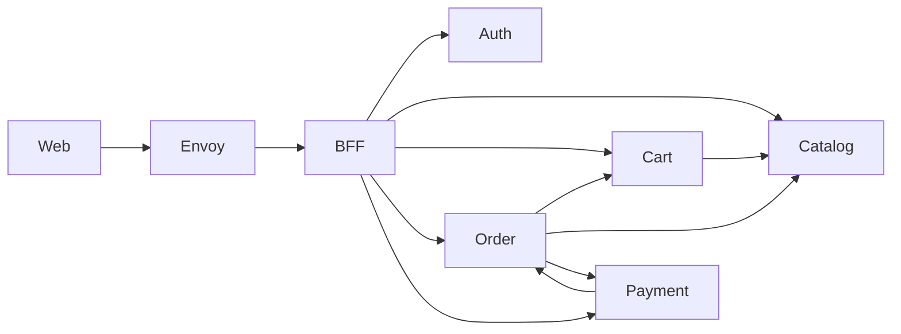

# shop-proto

Общий репозиторий protobuf-контрактов для микросервисного интернет-магазина. Содержит gRPC-сервисы, сообщения и события, из которых генерируется Go-код для использования в сервисах.

**Экосистема:** [infra](../shop-infra/README.md) · [proto](README.md) · [auth](../shop-auth/README.md) · [catalog](../shop-catolog/README.md) · [cart](../shop-cart/README.md) · [order](../shop-order/README.md) · [payment](../shop-payment/README.md) · [bff](../shop-BFF/README.md) · [web](../shop-web/README.md)

**Модуль:** `github.com/repeter513/shop-proto`  
**Go:** 1.26.3 · **Тег для сервисов:** `v0.2.6`

Реализации сервисов:

| Proto | Репозиторий |
|-------|-------------|
| `auth.v1` | [shop-auth](../shop-auth/README.md) |
| `catalog.v1` | [shop-catalog](../shop-catolog/README.md) (`shop-catolog`) |
| `cart.v1` | [shop-cart](../shop-cart/README.md) |
| `order.v1` | [shop-order](../shop-order/README.md) |
| `payment.v1` | [shop-payment](../shop-payment/README.md) |
| `events.v1` | асинхронные события (планируется) |

Локальный стек: [shop-infra](../shop-infra/README.md)

## Структура

```
proto/                  # исходные .proto файлы
├── auth/v1/
├── catalog/v1/
├── cart/v1/
├── order/v1/
├── payment/v1/
└── events/v1/

gen/go/                 # сгенерированный Go-код (protoc-gen-go, protoc-gen-go-grpc)
pkg/auth/               # Ed25519 JWT (Signer/Verifier) и gRPC auth interceptor
Makefile                # генерация
go.mod
```

## Сервисы

### Auth (`auth.v1.AuthService`) — [shop-auth](../shop-auth/README.md)

Контракт: [`proto/auth/v1/auth.proto`](proto/auth/v1/auth.proto)

| RPC | Описание |
|-----|----------|
| `RegisterUser` | Регистрация по email и паролю |
| `LoginUser` | Вход, выдача access/refresh токенов |
| `ValidateToken` | Проверка токена, получение user_id и ролей |
| `RefreshToken` | Обновление access-токена |
| `GetUserInfo` | Получение данных пользователя по ID |

### Catalog (`catalog.v1.CatalogService`) — [shop-catalog](../shop-catolog/README.md)

Контракт: [`proto/catalog/v1/catalog.proto`](proto/catalog/v1/catalog.proto)

| RPC | Auth | Описание |
|-----|------|----------|
| `GetProduct` | — | Товар по ID |
| `ListProducts` | — | Список товаров с пагинацией и фильтром по категории |
| `ListCategories` | — | Список категорий |
| `GetStock` | — | Доступный остаток |
| `ReserveStock` | JWT | Резервирование товара под заказ |
| `ReleaseStock` | JWT | Снятие резерва |
| `ConfirmReservation` | JWT | Подтверждение резерва — списание стока |

### Cart (`cart.v1.CartService`) — [shop-cart](../shop-cart/README.md)

Все RPC требуют JWT.

| RPC | Описание |
|-----|----------|
| `AddToCart` | Добавить товар |
| `UpdateCartItem` | Изменить количество |
| `RemoveFromCart` | Удалить позицию |
| `GetCart` | Получить корзину |
| `ClearCart` | Очистить корзину |

### Order (`order.v1.OrderService`) — [shop-order](../shop-order/README.md)

Все RPC требуют JWT.

| RPC | Описание |
|-----|----------|
| `CreateOrder` | Создать заказ из корзины пользователя |
| `PayOrder` | Оплатить заказ |
| `CancelOrder` | Отменить заказ |
| `GetOrder` | Заказ по ID |
| `ListOrders` | Список заказов пользователя с пагинацией |

Статусы заказа: `PENDING`, `PAID`, `FAILED`, `CANCELLED`.

### Payment (`payment.v1.PaymentService`) — [shop-payment](../shop-payment/README.md)

Все RPC требуют JWT. `CreatePaymentRequest` — только `order_id`; `user_id` и `amount` берутся из order-сервиса.

| RPC | Описание |
|-----|----------|
| `CreatePayment` | Создать платёж по заказу |
| `GetPayment` | Платёж по ID |
| `ListPayments` | Список платежей (`user_id` из JWT, фильтр `order_id`) |

Статусы платежа: `PENDING`, `SUCCESS`, `FAILED`.

## События (`events.v1`)

Сообщения для асинхронного обмена между сервисами (без gRPC-сервиса).

- **OrderEvent** — событие изменения статуса заказа (`PAID`, `FAILED`): order_id, user_id, total_price, payment_id.
- **Notification** — уведомление пользователю (email): subject, body, статус отправки.

## Архитектура



Подробнее про orchestration checkout: [shop-order](../shop-order/README.md).

## Генерация кода

**Зависимости:**

- [protoc](https://grpc.io/docs/protoc-installation/) — `brew install protobuf`
- Go-плагины устанавливаются через Makefile

```bash
make deps    # protoc-gen-go, protoc-gen-go-grpc
make proto   # генерация в gen/go/
make clean   # удалить gen/go/
```

## Использование в сервисах

```go
import (
    authv1 "github.com/repeter513/shop-proto/gen/go/auth/v1"
    catalogv1 "github.com/repeter513/shop-proto/gen/go/catalog/v1"
    cartv1 "github.com/repeter513/shop-proto/gen/go/cart/v1"
    orderv1 "github.com/repeter513/shop-proto/gen/go/order/v1"
    paymentv1 "github.com/repeter513/shop-proto/gen/go/payment/v1"
    eventsv1 "github.com/repeter513/shop-proto/gen/go/events/v1"
    pkgauth "github.com/repeter513/shop-proto/pkg/auth"
)
```

```bash
go get github.com/repeter513/shop-proto@v0.2.6
```

Сгенерированный код (`gen/go/`) коммитится в репозиторий, чтобы потребители могли импортировать модуль без локального запуска `protoc`.

## Auth (`pkg/auth`)

JWT подписывается **Ed25519 (EdDSA)**. Приватный ключ только в [shop-auth](../shop-auth/README.md); остальные сервисы держат публичный ключ и только проверяют токены.

### Генерация ключей (вне репозитория)

```bash
mkdir -p ~/.shop-keys
openssl genpkey -algorithm ED25519 -out ~/.shop-keys/private.pem
openssl pkey -in ~/.shop-keys/private.pem -pubout -out ~/.shop-keys/public.pem
chmod 600 ~/.shop-keys/private.pem
```

Ключи не коммитятся (`*.pem` в `.gitignore`).

Access-токен содержит `iss`, `aud` (список сервисов), refresh — `jti` + `aud: shop-auth`. Отзыв refresh по `jti` — **планируется** (пока только криптографическая проверка).

### Breaking change (v0.2.4)

| Было | Стало |
|------|-------|
| `NewJWT(secret, accessTTL, refreshTTL)` | `NewSigner(priv, accessTTL, refreshTTL, issuer, audience)` + `NewVerifier(pub, issuer, audience)` |
| `IssueRefreshToken(userID) (string, error)` | `IssueRefreshToken(userID) (token, jti, error)` |
| `UnaryServerInterceptor(secret []byte, ...)` | `UnaryServerInterceptor(verifier, ...)` |
| `ParseAccessUserID(token, secret)` | `ParseAccessUserID(token, verifier)` |
| HS256 + общий секрет | EdDSA + `iss`/`aud`/`jti` |

Старые HS256-токены после обновления сервисов не принимаются — нужен повторный login.
